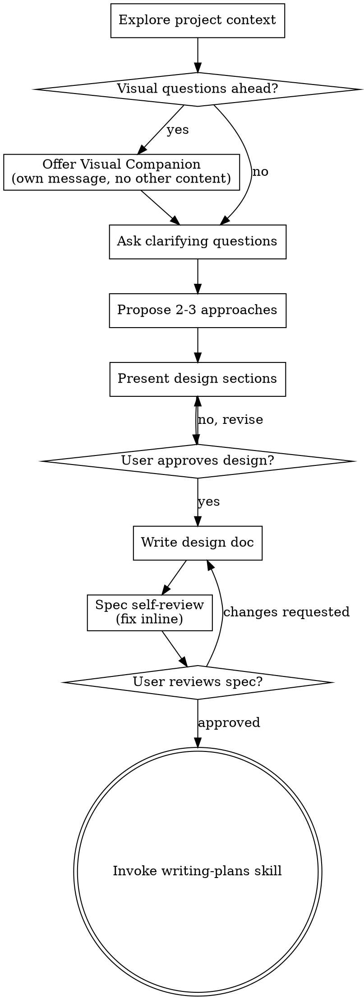

# 아이디어를 디자인으로 브레인스토밍

자연스러운 협업 대화를 통해 아이디어를 완전한 디자인·스펙으로 전환 도움.

현재 프로젝트 컨텍스트 이해부터 시작, 그 다음 아이디어 정제 위해 한 번에 하나씩 질문. 무엇을 구축할지 이해하면 디자인 제시·사용자 승인 획득.

<HARD-GATE>
디자인 제시·사용자 승인 전까지 어떤 구현 스킬 호출·코드 작성·프로젝트 scaffold·구현 동작 금지. 단순해 보이는 정도와 무관하게 모든 프로젝트에 적용.
</HARD-GATE>

## 안티패턴: "이건 너무 단순해서 디자인 불필요"

모든 프로젝트는 이 프로세스 거침. todo 리스트·단일 함수 유틸·설정 변경 모두. "단순" 프로젝트가 검증되지 않은 가정이 가장 많은 작업 낭비 유발하는 곳. 디자인은 짧을 수 있음 (진짜 단순한 프로젝트는 몇 문장) 하지만 반드시 제시·승인 획득.

## 체크리스트

각 항목에 대해 태스크 생성·순서대로 완료 필수:

1. **프로젝트 컨텍스트 탐색** — 파일·문서·최근 커밋 체크
2. **시각 동반자 제공** (주제가 시각 질문 포함 시) — 자체 메시지, 명확화 질문과 결합 X. 아래 시각 동반자 섹션 참조.
3. **명확화 질문** — 한 번에 하나씩. 목적·제약·성공 기준 이해
4. **2-3 접근 제안** — 트레이드오프·추천 포함
5. **디자인 제시** — 복잡도에 맞춰 섹션 스케일링. 각 섹션 후 사용자 승인 획득
6. **디자인 문서 작성** — `docs/superpowers/specs/YYYY-MM-DD-<topic>-design.md`에 저장·커밋
7. **스펙 self-review** — 플레이스홀더·모순·모호함·스코프 빠른 인라인 체크 (아래 참조)
8. **사용자가 작성된 스펙 리뷰** — 진행 전 사용자에게 스펙 파일 리뷰 요청
9. **구현 전환** — 구현 계획 생성에 writing-plans 스킬 호출

## 프로세스 흐름

**종료 상태는 writing-plans 호출.** frontend-design·mcp-builder·기타 구현 스킬 호출 금지. 브레인스토밍 후 호출하는 유일한 스킬은 writing-plans.

## 프로세스

**아이디어 이해:**

- 먼저 현재 프로젝트 상태 체크 (파일·문서·최근 커밋)
- 상세 질문 전에 스코프 평가: 요청이 다중 독립 서브시스템 기술 (예: "채팅·파일 저장·결제·분석이 있는 플랫폼 구축") 시 즉시 플래그. 먼저 분해 필요한 프로젝트 디테일 정제에 질문 낭비 X.
- 단일 스펙에 프로젝트가 너무 크면 사용자가 서브 프로젝트로 분해 도움: 독립 조각은 무엇·어떻게 관련·어떤 순서로 구축? 그 다음 첫 서브 프로젝트를 일반 디자인 흐름으로 브레인스토밍. 각 서브 프로젝트는 자체 spec → plan → 구현 사이클 가짐.
- 적절히 스코핑된 프로젝트는 아이디어 정제 위해 한 번에 하나씩 질문
- 가능하면 객관식 질문 선호. open-ended도 가능
- 메시지당 질문 하나만 — 주제가 더 탐색 필요하면 다중 질문으로 분할
- 이해에 집중: 목적·제약·성공 기준

**접근 탐색:**

- 트레이드오프와 함께 2-3 다른 접근 제안
- 추천·추론과 함께 옵션을 대화식으로 제시
- 추천 옵션을 lead·이유 설명

**디자인 제시:**

- 무엇을 구축할지 이해했다고 믿으면 디자인 제시
- 각 섹션을 복잡도에 맞춰 스케일: 단순하면 몇 문장, 미묘하면 200-300 단어까지
- 각 섹션 후 지금까지 맞는지 질문
- 커버: 아키텍처·컴포넌트·데이터 흐름·에러 처리·테스팅
- 의미 안 통하면 돌아가 명확화 준비

**격리·명료성 디자인:**

- 시스템을 각각 명확한 목적 하나·잘 정의된 인터페이스로 통신·독립적 이해·테스트 가능한 더 작은 단위로 분할
- 각 단위에 대해 답할 수 있어야 함: 무엇을 하는가·어떻게 사용하는가·무엇에 의존하는가?
- 누군가 내부를 읽지 않고 단위가 무엇을 하는지 이해 가능? 소비자 깨뜨리지 않고 내부 변경 가능? 아니면 경계 작업 필요.
- 더 작고 잘 경계 지어진 단위는 작업에도 더 쉬움 — 한 번에 컨텍스트에 담을 수 있는 코드에 더 잘 추론·집중된 파일에서 편집 더 신뢰 가능. 파일이 커지면 너무 많은 일 하는 신호.

**기존 코드베이스 작업:**

- 변경 제안 전 현재 구조 탐색. 기존 패턴 따름.
- 기존 코드가 작업에 영향 주는 문제 (예: 너무 커진 파일·불명확 경계·얽힌 책임) 있으면 디자인의 일부로 타겟화된 개선 포함 — 좋은 개발자가 작업 중인 코드 개선하는 방식.
- 무관 리팩토링 제안 X. 현재 목표에 집중 유지.

## 디자인 후

**문서:**

- 검증된 디자인 (spec)을 `docs/superpowers/specs/YYYY-MM-DD-<topic>-design.md`에 작성
  - (스펙 위치 사용자 선호가 이 기본값 오버라이드)
- elements-of-style:writing-clearly-and-concisely 스킬 가능 시 사용
- 디자인 문서를 git에 커밋

**스펙 Self-Review:**
스펙 문서 작성 후 신선한 눈으로 보기:

1. **플레이스홀더 스캔:** "TBD"·"TODO"·불완전 섹션·모호한 요구사항? 수정.
2. **내부 일관성:** 섹션이 서로 모순? 아키텍처가 기능 설명과 일치?
3. **스코프 체크:** 단일 구현 계획에 충분히 집중? 분해 필요?
4. **모호함 체크:** 어떤 요구사항이 두 가지로 해석 가능? 그러면 하나 선택·명시.

이슈 인라인 수정. 재리뷰 불필요 — 그냥 수정·진행.

**사용자 리뷰 게이트:**
스펙 리뷰 루프 통과 후 진행 전 사용자에게 작성된 스펙 리뷰 요청:

> "Spec written and committed to `<path>`. Please review it and let me know if you want to make any changes before we start writing out the implementation plan."

사용자 응답 대기. 변경 요청 시 변경·스펙 리뷰 루프 재실행. 사용자 승인 후에만 진행.

**구현:**

- 자세한 구현 계획 생성에 writing-plans 스킬 호출
- 다른 스킬 호출 X. writing-plans가 다음 단계.

## 핵심 원칙

- **한 번에 질문 하나** - 다중 질문으로 압도 X
- **객관식 선호** - 가능하면 open-ended보다 답변 쉬움
- **YAGNI 무자비하게** - 모든 디자인에서 불필요 기능 제거
- **대안 탐색** - 정착 전 항상 2-3 접근 제안
- **점진적 검증** - 디자인 제시·진행 전 승인 획득
- **유연함** - 의미 안 통하면 돌아가 명확화

## 시각 동반자

브레인스토밍 중 mockup·다이어그램·시각 옵션 표시용 브라우저 기반 동반자. 도구 — 모드 아님. 동반자 수락은 시각 처리 혜택 받는 질문에 사용 가능 의미. 모든 질문이 브라우저 거치는 것 아님.

**동반자 제공:** 다가오는 질문이 시각 컨텐츠 (mockup·레이아웃·다이어그램) 포함 예상 시 동의 위해 한 번 제공:
> "Some of what we're working on might be easier to explain if I can show it to you in a web browser. I can put together mockups, diagrams, comparisons, and other visuals as we go. This feature is still new and can be token-intensive. Want to try it? (Requires opening a local URL)"

**이 제공은 반드시 자체 메시지여야 함.** 명확화 질문·컨텍스트 요약·기타 컨텐츠와 결합 X. 메시지는 위 제공만 포함하고 그 외 없음. 사용자 응답 대기 후 계속. 거절 시 텍스트 전용 브레인스토밍 진행.

**질문별 결정:** 사용자 수락 후에도 각 질문마다 브라우저 vs 터미널 사용 결정. 테스트: **사용자가 읽기보다 보면 더 잘 이해할까?**

- **브라우저 사용** 컨텐츠 자체가 시각인 경우 — mockup·와이어프레임·레이아웃 비교·아키텍처 다이어그램·side-by-side 시각 디자인
- **터미널 사용** 컨텐츠가 텍스트인 경우 — 요구사항 질문·개념 선택·트레이드오프 리스트·A/B/C/D 텍스트 옵션·스코프 결정

UI 주제 관한 질문이 자동으로 시각 질문 X. "이 컨텍스트에서 personality란 무엇?"은 개념 질문 — 터미널 사용. "어느 wizard 레이아웃이 더 나은가?"는 시각 질문 — 브라우저 사용.

동반자 동의 시 진행 전 상세 가이드 읽기:
`skills/brainstorming/visual-companion.md`
