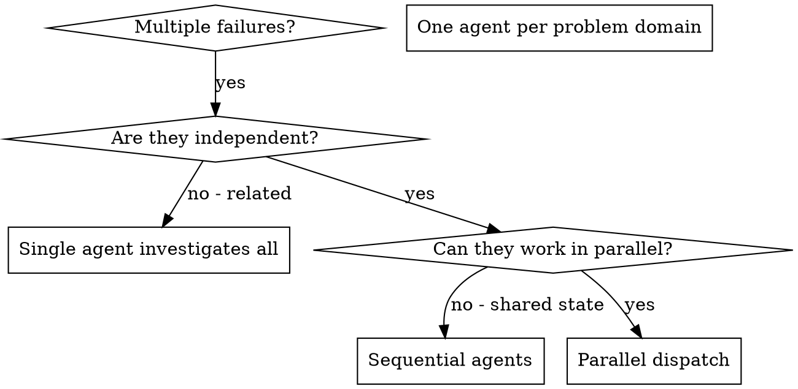

# 병렬 에이전트 디스패칭

## 개요

격리된 컨텍스트로 전문 에이전트에 태스크 위임. 지시·컨텍스트를 정밀하게 만들어 집중·성공 보장. 절대 세션 컨텍스트·히스토리 상속 X — 필요한 것만 정확히 구성. 이로써 자체 컨텍스트를 조율 작업에 보존.

여러 무관 실패 (다른 테스트 파일·다른 서브시스템·다른 버그) 있을 때 순차 조사는 시간 낭비. 각 조사는 독립이고 병렬 가능.

**핵심 원칙:** 독립 문제 도메인당 에이전트 하나 디스패치. 동시 작업.

## 사용 시점



**사용:**
- 다른 근본 원인으로 3개 이상 테스트 파일 실패
- 다중 서브시스템 독립적으로 깨짐
- 각 문제를 다른 컨텍스트 없이 이해 가능
- 조사 간 공유 상태 없음

**사용 X:**
- 실패가 관련 (하나 수정이 다른 것 수정 가능)
- 전체 시스템 상태 이해 필요
- 에이전트 간섭

## 패턴

### 1. 독립 도메인 식별

깨진 것별로 실패 그룹화:
- File A 테스트: 도구 승인 흐름
- File B 테스트: 배치 완료 동작
- File C 테스트: 중단 기능

각 도메인 독립 - 도구 승인 수정이 중단 테스트 영향 X.

### 2. 집중된 에이전트 태스크 생성

각 에이전트 받음:
- **특정 스코프:** 테스트 파일·서브시스템 하나
- **명확 목표:** 이 테스트 통과시킴
- **제약:** 다른 코드 변경 X
- **기대 출력:** 발견·수정 요약

### 3. 병렬 디스패치

```typescript
// Claude Code / AI 환경에서
Task("Fix agent-tool-abort.test.ts failures")
Task("Fix batch-completion-behavior.test.ts failures")
Task("Fix tool-approval-race-conditions.test.ts failures")
// 셋 다 동시 실행
```

### 4. 리뷰·통합

에이전트 반환 시:
- 각 요약 읽기
- 수정 충돌 없음 검증
- 전체 테스트 스위트 실행
- 모든 변경 통합

## 에이전트 프롬프트 구조

좋은 에이전트 프롬프트:
1. **집중** - 명확 문제 도메인 하나
2. **자체 포함** - 문제 이해에 필요한 모든 컨텍스트
3. **출력 명세** - 에이전트가 무엇 반환?

```markdown
src/agents/agent-tool-abort.test.ts의 3개 실패 테스트 수정:

1. "should abort tool with partial output capture" - 메시지에 'interrupted at' 예상
2. "should handle mixed completed and aborted tools" - 빠른 도구가 완료 대신 중단됨
3. "should properly track pendingToolCount" - 3개 결과 예상하나 0 받음

이는 타이밍/race condition 이슈. 태스크:

1. 테스트 파일 읽기·각 테스트가 검증하는 것 이해
2. 근본 원인 식별 - 타이밍 이슈 또는 실제 버그?
3. 수정:
   - 임의 timeout을 이벤트 기반 대기로 교체
   - 발견된 중단 구현 버그 수정
   - 변경된 동작 테스트 시 테스트 기대 조정

타임아웃만 늘리지 말 것 - 실제 이슈 찾기.

반환: 발견·수정 요약.
```

## 일반 실수

**❌ 너무 광범위:** "모든 테스트 수정" - 에이전트 길 잃음
**✅ 특정:** "agent-tool-abort.test.ts 수정" - 집중 스코프

**❌ 컨텍스트 없음:** "race condition 수정" - 에이전트가 어딘지 모름
**✅ 컨텍스트:** 에러 메시지·테스트 이름 붙여넣기

**❌ 제약 없음:** 에이전트가 모두 리팩토링 가능
**✅ 제약:** "프로덕션 코드 변경 X" 또는 "테스트만 수정"

**❌ 모호한 출력:** "수정" - 무엇 변경되었는지 모름
**✅ 특정:** "근본 원인·변경 요약 반환"

## 사용 안 함 시점

**관련 실패:** 하나 수정이 다른 것 수정 가능 - 먼저 함께 조사
**전체 컨텍스트 필요:** 이해가 전체 시스템 봐야 함
**탐색 디버깅:** 무엇이 깨졌는지 아직 모름
**공유 상태:** 에이전트 간섭 (같은 파일 편집·같은 자원 사용)

## 세션 실제 예시

**시나리오:** 주요 리팩토링 후 3개 파일에 걸친 6개 테스트 실패

**실패:**
- agent-tool-abort.test.ts: 3 실패 (타이밍 이슈)
- batch-completion-behavior.test.ts: 2 실패 (도구 실행 안 됨)
- tool-approval-race-conditions.test.ts: 1 실패 (실행 카운트 = 0)

**결정:** 독립 도메인 - 중단 로직, 배치 완료, race condition 분리

**디스패치:**
```
Agent 1 → Fix agent-tool-abort.test.ts
Agent 2 → Fix batch-completion-behavior.test.ts
Agent 3 → Fix tool-approval-race-conditions.test.ts
```

**결과:**
- Agent 1: 타임아웃을 이벤트 기반 대기로 교체
- Agent 2: 이벤트 구조 버그 수정 (잘못된 위치의 threadId)
- Agent 3: async 도구 실행 완료 대기 추가

**통합:** 모든 수정 독립·충돌 없음·전체 스위트 green

**시간 절약:** 순차 대비 병렬 3 문제 해결

## 핵심 혜택

1. **병렬화** - 다중 조사가 동시 발생
2. **집중** - 각 에이전트가 좁은 스코프·적은 컨텍스트 추적
3. **독립성** - 에이전트 간섭 X
4. **속도** - 1의 시간에 3 문제 해결

## 검증

에이전트 반환 후:
1. **각 요약 리뷰** - 무엇 변경되었는지 이해
2. **충돌 체크** - 에이전트가 같은 코드 편집?
3. **전체 스위트 실행** - 모든 수정이 함께 동작 검증
4. **Spot check** - 에이전트가 시스템적 에러 가능

## 실제 영향

디버깅 세션 (2025-10-03):
- 3개 파일에 걸친 6개 실패
- 3개 에이전트 병렬 디스패치
- 모든 조사 동시 완료
- 모든 수정 성공적 통합
- 에이전트 변경 간 0 충돌
