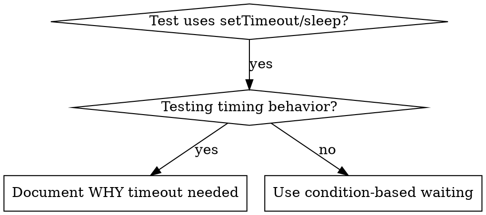

# 조건 기반 대기

## 개요

Flaky 테스트는 종종 임의 지연으로 타이밍 추측. 빠른 머신에서 통과하나 부하·CI에서 실패하는 race condition 생성.

**핵심 원칙:** 얼마나 걸리는지 추측 아닌 실제 신경 쓰는 조건 대기.

## 사용 시점



**사용:**
- 테스트에 임의 지연 (`setTimeout`·`sleep`·`time.sleep()`)
- 테스트 flaky (가끔 통과·부하 하 실패)
- 병렬 실행 시 테스트 타임아웃
- async 연산 완료 대기

**사용 X:**
- 실제 타이밍 동작 테스트 (debounce·throttle 간격)
- 임의 타임아웃 사용 시 항상 WHY 문서화

## 핵심 패턴

```typescript
// ❌ BEFORE: 타이밍 추측
await new Promise(r => setTimeout(r, 50));
const result = getResult();
expect(result).toBeDefined();

// ✅ AFTER: 조건 대기
await waitFor(() => getResult() !== undefined);
const result = getResult();
expect(result).toBeDefined();
```

## 빠른 패턴

| Scenario | Pattern |
|----------|---------|
| 이벤트 대기 | `waitFor(() => events.find(e => e.type === 'DONE'))` |
| 상태 대기 | `waitFor(() => machine.state === 'ready')` |
| 카운트 대기 | `waitFor(() => items.length >= 5)` |
| 파일 대기 | `waitFor(() => fs.existsSync(path))` |
| 복잡 조건 | `waitFor(() => obj.ready && obj.value > 10)` |

## 구현

제네릭 폴링 함수:
```typescript
async function waitFor<T>(
  condition: () => T | undefined | null | false,
  description: string,
  timeoutMs = 5000
): Promise<T> {
  const startTime = Date.now();

  while (true) {
    const result = condition();
    if (result) return result;

    if (Date.now() - startTime > timeoutMs) {
      throw new Error(`Timeout waiting for ${description} after ${timeoutMs}ms`);
    }

    await new Promise(r => setTimeout(r, 10)); // 10ms마다 폴링
  }
}
```

도메인 특정 헬퍼 (`waitForEvent`·`waitForEventCount`·`waitForEventMatch`) 있는 완전 구현은 이 디렉터리의 `condition-based-waiting-example.ts` 참조.

## 일반 실수

**❌ 너무 빠른 폴링:** `setTimeout(check, 1)` - CPU 낭비
**✅ 수정:** 10ms마다 폴링

**❌ 타임아웃 없음:** 조건 절대 만족 안 되면 영원히 루프
**✅ 수정:** 명확한 에러와 함께 항상 타임아웃 포함

**❌ Stale 데이터:** 루프 전 상태 캐시
**✅ 수정:** 신선한 데이터 위해 루프 내 getter 호출

## 임의 타임아웃이 올바를 때

```typescript
// 도구가 100ms마다 tick·partial 출력 검증에 2 tick 필요
await waitForEvent(manager, 'TOOL_STARTED'); // 첫째: 조건 대기
await new Promise(r => setTimeout(r, 200));   // 그 다음: 타이밍 동작 대기
// 200ms = 100ms 간격에 2 tick - 문서화·정당화
```

**요구사항:**
1. 먼저 트리거 조건 대기
2. 알려진 타이밍 기반 (추측 X)
3. WHY 설명 주석

## 실제 영향

디버깅 세션 (2025-10-03):
- 3개 파일에 걸친 15 flaky 테스트 수정
- 통과율: 60% → 100%
- 실행 시간: 40% 빠름
- race condition 더 없음
