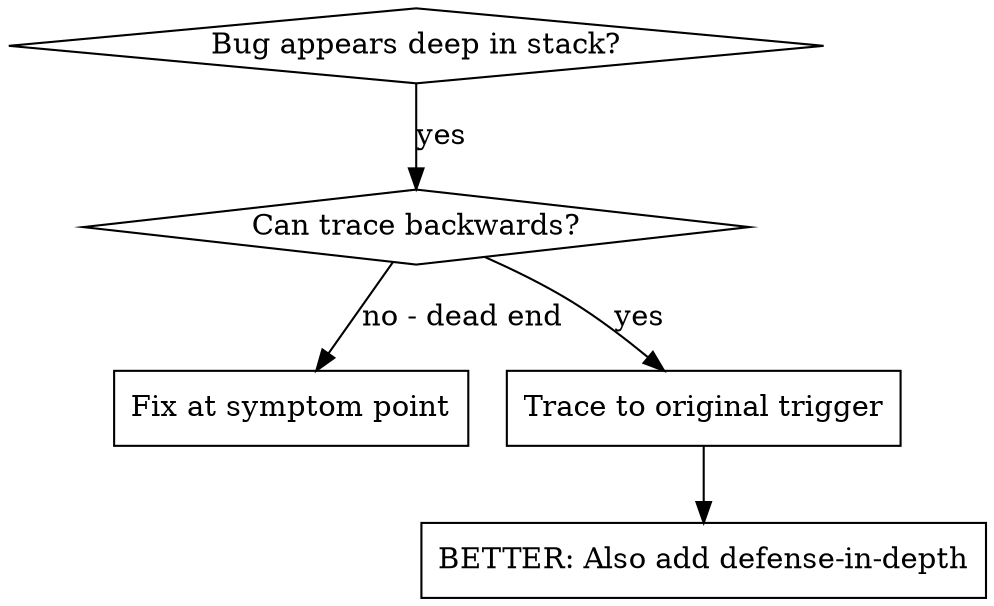
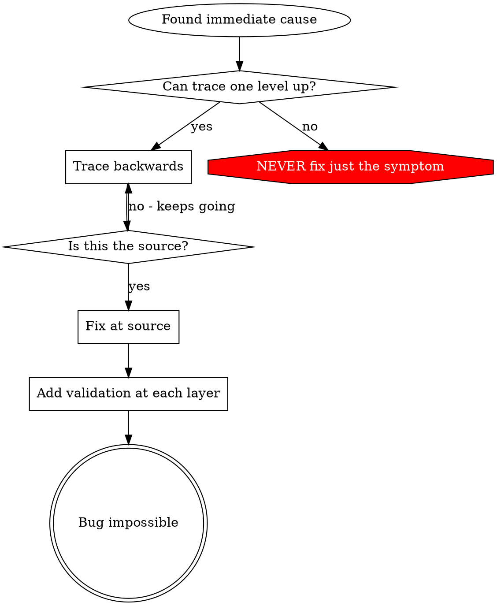

# 근본 원인 추적

## 개요

버그는 종종 호출 스택 깊이 발현 (잘못된 디렉터리의 git init·잘못된 위치 파일 생성·잘못된 경로 DB 오픈). 본능은 에러 나타나는 곳 수정·하지만 그게 증상 처리.

**핵심 원칙:** 원래 트리거 찾을 때까지 호출 체인 통해 역방향 추적·그 다음 소스에서 수정.

## 사용 시점



**사용:**
- 실행 깊이에서 에러 발생 (진입점 X)
- 스택 트레이스가 긴 호출 체인 표시
- 잘못된 데이터 어디서 발생했는지 불명확
- 어느 테스트/코드가 문제 트리거하는지 찾아야 함

## 추적 프로세스

### 1. 증상 관찰
```
Error: git init failed in ~/project/packages/core
```

### 2. 즉시 원인 찾기
**무슨 코드가 이를 직접 유발?**
```typescript
await execFileAsync('git', ['init'], { cwd: projectDir });
```

### 3. 질문: 무엇이 이를 호출?
```typescript
WorktreeManager.createSessionWorktree(projectDir, sessionId)
  → Session.initializeWorkspace() 호출
  → Session.create() 호출
  → Project.create()의 테스트 호출
```

### 4. 위로 추적 계속
**어떤 값 전달?**
- `projectDir = ''` (빈 문자열!)
- `cwd`로서 빈 문자열은 `process.cwd()`로 해결
- 그게 소스 코드 디렉터리!

### 5. 원래 트리거 찾기
**빈 문자열은 어디서?**
```typescript
const context = setupCoreTest(); // 반환 { tempDir: '' }
Project.create('name', context.tempDir); // beforeEach 전 접근!
```

## 스택 트레이스 추가

수동 추적 불가 시 instrumentation 추가:

```typescript
// 문제 연산 전
async function gitInit(directory: string) {
  const stack = new Error().stack;
  console.error('DEBUG git init:', {
    directory,
    cwd: process.cwd(),
    nodeEnv: process.env.NODE_ENV,
    stack,
  });

  await execFileAsync('git', ['init'], { cwd: directory });
}
```

**중요:** 테스트에서 `console.error()` 사용 (logger X - 표시 안 될 수 있음)

**실행·캡처:**
```bash
npm test 2>&1 | grep 'DEBUG git init'
```

**스택 트레이스 분석:**
- 테스트 파일 이름 찾기
- 호출 트리거 라인 번호 찾기
- 패턴 식별 (같은 테스트? 같은 파라미터?)

## 어느 테스트가 오염 유발하는지 찾기

테스트 동안 무엇 나타나지만 어느 테스트 모름 시:

이 디렉터리의 bisection 스크립트 `find-polluter.sh` 사용:

```bash
./find-polluter.sh '.git' 'src/**/*.test.ts'
```

테스트를 하나씩 실행·첫 폴루터에서 중단. 사용법은 스크립트 참조.

## 실제 예: 빈 projectDir

**증상:** `.git`이 `packages/core/` (소스 코드)에 생성

**추적 체인:**
1. `git init`이 `process.cwd()`에서 실행 ← 빈 cwd 파라미터
2. WorktreeManager가 빈 projectDir로 호출
3. Session.create()가 빈 문자열 전달
4. 테스트가 beforeEach 전 `context.tempDir` 접근
5. setupCoreTest()가 처음에 `{ tempDir: '' }` 반환

**근본 원인:** Top-level 변수 초기화가 빈 값 접근

**수정:** beforeEach 전 접근 시 throw하는 getter로 tempDir 만듦

**다층 방어도 추가:**
- Layer 1: Project.create()가 디렉터리 검증
- Layer 2: WorkspaceManager가 비어있지 않음 검증
- Layer 3: NODE_ENV 가드가 tmpdir 외 git init 거부
- Layer 4: git init 전 스택 트레이스 로깅

## 핵심 원칙



**에러 나타나는 곳만 절대 수정 X.** 원래 트리거 찾으려 역방향 추적.

## 스택 트레이스 팁

**테스트에서:** logger 아닌 `console.error()` 사용 - logger 억제 가능
**연산 전:** 실패 후 X·위험 연산 전 로깅
**컨텍스트 포함:** 디렉터리·cwd·환경 변수·타임스탬프
**스택 캡처:** `new Error().stack`이 완전 호출 체인 표시

## 실제 영향

디버깅 세션 (2025-10-03):
- 5-레벨 추적으로 근본 원인 발견
- 소스에서 수정 (getter 검증)
- 4 레이어 방어 추가
- 1847 테스트 통과·0 오염
