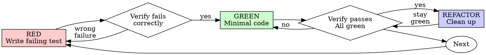

# TDD (Test-Driven Development)

## 개요

먼저 테스트 작성. 실패 관찰. 통과시킬 최소 코드 작성.

**핵심 원칙:** 테스트 실패 안 봤으면 옳은 것 테스트하는지 모름.

**규칙의 문자 위반은 규칙의 정신 위반.**

## 사용 시점

**항상:**
- 새 기능
- 버그 수정
- 리팩토링
- 동작 변경

**예외 (your human partner에 질문):**
- 일회용 프로토타입
- 생성된 코드
- 설정 파일

"이번만 TDD 건너뜀" 생각? 중단. 그건 합리화.

## 철칙

```
실패 테스트 없이 프로덕션 코드 X
```

테스트 전 코드 작성? 삭제. 다시 시작.

**예외 없음:**
- "참조"로 유지 X
- 테스트 작성하며 "적응" X
- 보지 마라
- 삭제는 삭제 의미

테스트에서 신선하게 구현. 기간.

## Red-Green-Refactor



### RED - 실패 테스트 작성

무엇 일어나야 하는지 보여주는 최소 테스트 하나 작성.

<Good>
```typescript
test('retries failed operations 3 times', async () => {
  let attempts = 0;
  const operation = () => {
    attempts++;
    if (attempts < 3) throw new Error('fail');
    return 'success';
  };

  const result = await retryOperation(operation);

  expect(result).toBe('success');
  expect(attempts).toBe(3);
});
```
명확한 이름·실제 동작 테스트·한 가지
</Good>

<Bad>
```typescript
test('retry works', async () => {
  const mock = jest.fn()
    .mockRejectedValueOnce(new Error())
    .mockRejectedValueOnce(new Error())
    .mockResolvedValueOnce('success');
  await retryOperation(mock);
  expect(mock).toHaveBeenCalledTimes(3);
});
```
모호한 이름·코드 아닌 mock 테스트
</Bad>

**요구사항:**
- 동작 하나
- 명확한 이름
- 실제 코드 (불가피하지 않은 한 mock X)

### Verify RED - 실패 관찰

**필수. 절대 건너뜀 X.**

```bash
npm test path/to/test.test.ts
```

확인:
- 테스트 실패 (에러 X)
- 실패 메시지 예상
- 기능 누락으로 실패 (오타 X)

**테스트 통과?** 기존 동작 테스트 중. 테스트 수정.

**테스트 에러?** 에러 수정·올바르게 실패할 때까지 재실행.

### GREEN - 최소 코드

테스트 통과시킬 최단순 코드 작성.

<Good>
```typescript
async function retryOperation<T>(fn: () => Promise<T>): Promise<T> {
  for (let i = 0; i < 3; i++) {
    try {
      return await fn();
    } catch (e) {
      if (i === 2) throw e;
    }
  }
  throw new Error('unreachable');
}
```
통과시킬 만큼만
</Good>

<Bad>
```typescript
async function retryOperation<T>(
  fn: () => Promise<T>,
  options?: {
    maxRetries?: number;
    backoff?: 'linear' | 'exponential';
    onRetry?: (attempt: number) => void;
  }
): Promise<T> {
  // YAGNI
}
```
과잉 엔지니어
</Bad>

기능 추가·다른 코드 리팩토링·테스트 너머 "개선" X.

### Verify GREEN - 통과 관찰

**필수.**

```bash
npm test path/to/test.test.ts
```

확인:
- 테스트 통과
- 다른 테스트 여전히 통과
- 출력 깨끗 (에러·경고 없음)

**테스트 실패?** 테스트 아닌 코드 수정.

**다른 테스트 실패?** 지금 수정.

### REFACTOR - 정리

green 후에만:
- 중복 제거
- 이름 개선
- 헬퍼 추출

테스트 green 유지. 동작 추가 X.

### 반복

다음 기능의 다음 실패 테스트.

## 좋은 테스트

| Quality | Good | Bad |
|---------|------|-----|
| **최소** | 한 가지. 이름에 "and"? 분할. | `test('validates email and domain and whitespace')` |
| **명확** | 이름이 동작 설명 | `test('test1')` |
| **의도 표시** | 원하는 API 시연 | 코드가 무엇 해야 하는지 가림 |

## 순서가 왜 중요

**"통과 검증을 위해 나중에 테스트 작성"**

코드 후 작성한 테스트는 즉시 통과. 즉시 통과는 아무것도 증명 X:
- 잘못된 것 테스트 가능
- 동작 아닌 구현 테스트 가능
- 잊은 엣지 케이스 놓침 가능
- 버그 잡는 것 절대 못 봄

테스트 우선이 테스트 실패 보게 강제·실제로 무엇 테스트하는지 증명.

**"모든 엣지 케이스 수동 테스트했음"**

수동 테스팅은 ad-hoc. 모든 것 테스트했다 생각하지만:
- 무엇 테스트했는지 기록 없음
- 코드 변경 시 재실행 불가
- 압박 하에 케이스 잊기 쉬움
- "시도했을 때 동작" ≠ 포괄적

자동 테스트는 시스템적. 매번 같은 방식 실행.

**"X 시간 작업 삭제는 낭비"**

매몰 비용 오류. 시간은 이미 갔음. 지금 선택:
- 삭제·TDD로 재작성 (X 시간 더, 높은 자신감)
- 유지·나중 테스트 추가 (30분, 낮은 자신감, 버그 가능성)

"낭비"는 신뢰할 수 없는 코드 유지. 실제 테스트 없는 동작 코드는 기술 부채.

**"TDD는 도그마, 실용은 적응 의미"**

TDD는 실용적:
- 커밋 전 버그 발견 (후 디버깅보다 빠름)
- 회귀 방지 (테스트가 즉시 깨짐 잡음)
- 동작 문서화 (테스트가 코드 사용법 표시)
- 리팩토링 가능 (자유롭게 변경·테스트가 깨짐 잡음)

"실용" 단축 = 프로덕션 디버깅 = 더 느림.

**"테스트 후가 같은 목표 달성 - 의식 아닌 정신"**

X. 테스트 후는 "이게 뭐 함?" 답. 테스트 우선은 "이게 뭐 해야 함?" 답.

테스트 후는 구현으로 편향. 필요한 것 아닌 구축한 것 테스트. 발견된 엣지 케이스 아닌 기억된 것 검증.

테스트 우선이 구현 전 엣지 케이스 발견 강제. 테스트 후는 모든 것 기억했는지 검증 (못 했음).

30분의 테스트 후 ≠ TDD. 커버리지 얻고 테스트 동작 증명 잃음.

## 일반 합리화

| Excuse | Reality |
|--------|---------|
| "테스트하기 너무 단순" | 단순 코드도 깨짐. 테스트 30초. |
| "나중 테스트" | 즉시 통과는 아무것도 증명 X. |
| "테스트 후도 같은 목표" | 후 = "뭐 함?" 우선 = "뭐 해야 함?" |
| "이미 수동 테스트" | Ad-hoc ≠ 시스템적. 기록 없음·재실행 불가. |
| "X 시간 삭제 낭비" | 매몰 비용. 미검증 코드 유지가 기술 부채. |
| "참조로 유지, 먼저 테스트" | 적응 가능. 그게 테스트 후. 삭제는 삭제. |
| "먼저 탐색 필요" | OK. 탐색 버리고 TDD로 시작. |
| "테스트 어려움 = 디자인 불명확" | 테스트 들음. 테스트 어려움 = 사용 어려움. |
| "TDD가 느리게 만듦" | TDD가 디버깅보다 빠름. 실용 = 테스트 우선. |
| "수동 테스트 빠름" | 수동은 엣지 케이스 증명 X. 매 변경 재테스트. |
| "기존 코드에 테스트 없음" | 개선 중. 기존 코드에 테스트 추가. |

## 적신호 - STOP·다시 시작

- 테스트 전 코드
- 구현 후 테스트
- 테스트 즉시 통과
- 테스트 실패 이유 설명 불가
- 테스트 "나중" 추가
- "이번만" 합리화
- "이미 수동 테스트"
- "테스트 후가 같은 목적 달성"
- "의식 아닌 정신"
- "참조로 유지" 또는 "기존 코드 적응"
- "이미 X 시간 썼음·삭제 낭비"
- "TDD 도그마·실용 중"
- "이건 다름 왜냐..."

**모두 의미: 코드 삭제. TDD로 다시 시작.**

## 예시: 버그 수정

**버그:** 빈 이메일 수락

**RED**
```typescript
test('rejects empty email', async () => {
  const result = await submitForm({ email: '' });
  expect(result.error).toBe('Email required');
});
```

**Verify RED**
```bash
$ npm test
FAIL: expected 'Email required', got undefined
```

**GREEN**
```typescript
function submitForm(data: FormData) {
  if (!data.email?.trim()) {
    return { error: 'Email required' };
  }
  // ...
}
```

**Verify GREEN**
```bash
$ npm test
PASS
```

**REFACTOR**
필요 시 다중 필드 검증 추출.

## 검증 체크리스트

작업 완료 표시 전:

- [ ] 모든 새 함수/메서드에 테스트
- [ ] 구현 전 각 테스트 실패 관찰
- [ ] 각 테스트가 예상 이유로 실패 (오타 X, 기능 누락)
- [ ] 각 테스트 통과시킬 최소 코드 작성
- [ ] 모든 테스트 통과
- [ ] 출력 깨끗 (에러·경고 없음)
- [ ] 테스트가 실제 코드 사용 (불가피하지 않으면 mock X)
- [ ] 엣지 케이스·에러 커버

모든 박스 체크 불가? TDD 건너뜀. 다시 시작.

## 막힐 때

| Problem | Solution |
|---------|----------|
| 테스트 방법 모름 | 원하는 API 작성. 먼저 단언 작성. your human partner 질문. |
| 테스트 너무 복잡 | 디자인 너무 복잡. 인터페이스 단순화. |
| 모든 것 mock해야 함 | 코드 너무 결합. DI 사용. |
| 테스트 setup 거대 | 헬퍼 추출. 여전히 복잡? 디자인 단순화. |

## 디버깅 통합

버그 발견? 재현 실패 테스트 작성. TDD 사이클 따름. 테스트가 수정 증명·회귀 방지.

테스트 없이 버그 수정 절대 X.

## 테스팅 안티패턴

mock·테스트 유틸 추가 시 일반 함정 회피 위해 @testing-anti-patterns.md 읽기:
- 실제 동작 아닌 mock 동작 테스트
- 프로덕션 클래스에 테스트 전용 메서드 추가
- 의존성 이해 없이 mock

## 최종 규칙

```
프로덕션 코드 → 테스트 존재·먼저 실패
그 외 → TDD 아님
```

your human partner 허락 없이 예외 X.
